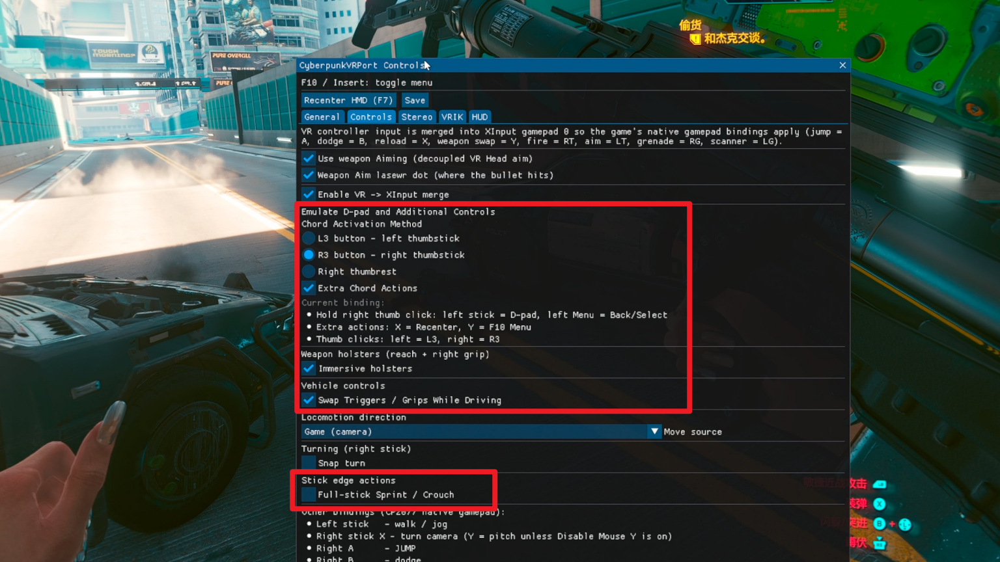

<p align="right"><a href="README-TC.md">中文說明</a></p>

# CyberpunkVR Port - Tofu Express X

**Tofu Express X** is an enhanced release of CyberpunkVR based on the original work by [dariulone](https://github.com/dariulone). It packages tested fixes and improvements from this fork that are not yet available in the upstream release.

This release is based on upstream **CyberpunkVR v0.1.1** and focuses on making weapon aiming and VR controller input more stable, accurate, and comfortable to use.

### Improvements in Tofu Express 2

- **The weapon laser dot no longer jumps when entering ADS.** Your aim now stays consistent when switching between hip fire and ADS, including when using high-magnification sniper scopes.
- **The laser dot is much more stable during fast head turns.** Long trails and multiple separated dots have been greatly reduced, making the indicator easier to follow during combat.
- **Reflex reticles and sniper-scope crosshairs now stay aligned with the laser dot.** ADS zoom no longer causes the weapon sight and the actual aiming direction to drift apart.
- **Non-VRIK ADS aiming is more predictable.** Raising the weapon into ADS now keeps it close to the point you were aiming at before the animation started. This also lays the groundwork for improving the head-aiming—or **Gun-Face**—mode in the next release. Some players simply prefer aiming with their face instead of waving VR controllers around.

Under the hood, the weapon, sight, ADS zoom, and aiming-indicator paths now use more consistent camera and timing data. The practical result is simple: **what you see through the sight is much closer to where the weapon is actually aiming.**

### Also includes everything from [controller-enhancements](https://github.com/dabinn/cyberpunk-vr-port/releases/download/v0.1.1-controller-enhancements/CyberpunkVRPort-0.1.1-controller-enhancements.zip)

This release includes all changes from the previous **controller-enhancements** release:

- **More flexible controller chords.** Choose L3, R3, or the right thumbrest as the chord activator, depending on your controller and preference.
- **Complete Xbox controller button mapping through VR controllers.** Every Xbox controller button is now supported, filling in the inputs that were missing from the original mod.
- **Optional controller shortcuts for VR recentering and the F10 menu.**
- **More reliable L3/R3 behavior.** Normal thumbstick clicks remain usable during gameplay, while accidental actions in game menus are reduced.
- **Added a toggle for full-stick sprint and crouch.** The original mod always enables sprint when the left stick is pushed fully forward and crouch when the right stick is pushed fully down. This behavior can now be enabled or disabled from the F10 menu.
- **Improved right-hand grip-button routing.** It operates immersive weapon holsters while your hand is inside a holster zone and works as RB everywhere else.
- **Safer vehicle controls.** Holster gestures are disabled while driving to prevent accidental weapon actions.
- **Added an optional vehicle-only trigger/grip swap.** This keeps firing on the right trigger, consistent with on-foot combat, while the analog VR grip buttons control acceleration and braking. Xbox controller input is not affected.
- **Fixed vertical camera control.** Turning off **Disable Mouse Y** now correctly restores mouse and right-stick vertical look.




- **RB now works normally**, so you can shoot while driving.
- RB and the original **visual holsters** still work together: squeeze Right
  Grip inside a holster zone to use it, or anywhere else for RB. Visual holsters
  are temporarily disabled in vehicles so you cannot put your weapon away by
  accident.
- An optional driving layout automatically swaps Triggers and Grips, keeping
  Fire on Right Trigger while the analog grips control brake and accelerator.
- Chord controls provide every standard Xbox controller input, plus VR Recenter
  and the F10 menu—no keyboard required. Choose L3, R3, or a Virtual
  Desktop-style Right Thumbrest touch as the activation control.
- **Disable Mouse Y (Pitch)** is fixed, so the right stick or mouse can freely
  look up and down instead of being limited to horizontal turning.
- Full-stick Sprint / Crouch is now optional. Turn both this option and Disable
  Mouse Y (Pitch) off to use the full right-stick range for vertical look.

[Watch the vehicle combat demonstration on YouTube](https://www.youtube.com/watch?v=n6bx6JbvSgs)


### Controller setup

Press **F10**, open **Controls**, and choose the options you prefer. Settings are
saved automatically.

#### Emulate D-pad and Additional Controls

Choose one **Chord Activation Method**. The default is the original L3 method:

| Activation method | D-pad | Back / Select | VR Recenter | F10 Menu |
|---|---|---|---|---|
| Hold **L3** (left thumbstick click) | Right stick | Left Menu | A | B |
| Hold **R3** (right thumbstick click) | Left stick | Left Menu | X | Y |
| Touch **Right Thumbrest** | Left stick | Left Menu | X | Y |

Hold the activation control first, then move the stick or press the other button.
L3 and R3 keep their normal functions.

Left Menu sends Start; chord + Left Menu sends Back / Select. D-pad and Back /
Select are always enabled. **Extra Chord Actions** adds Recenter and F10 Menu and
is on by default.

**Right Thumbrest** is the touch-sensitive area beside the face buttons where
your thumb naturally rests, so it can activate the chord without a click. Only
some VR controllers support it, including Quest 3; unsupported controllers fall
back to L3.

Keyboard shortcuts also remain available: **F7** for Recenter and **F10 /
Insert** for the menu.

#### Right Grip and visual holsters

- Grip inside a shoulder or hip holster zone: use the original visual holster.
- Grip anywhere else: send **RB**.
- In a vehicle: visual holsters are disabled.

#### Swap Triggers / Grips While Driving

Enable this option to keep shooting on Right Trigger while driving:

| VR input | Emulated gamepad input |
|---|---|
| Left Trigger | LB |
| Right Trigger | RB |
| Left analog Grip | LT |
| Right analog Grip | RT |

The analog grips become brake and accelerator. Only VR controller input is
changed; physical gamepads are unaffected. This option is **off by default**.

#### Other options

| Setting | Behavior |
|---|---|
| **Disable Mouse Y (Pitch)** | On: HMD-only vertical look. Off: mouse and right-stick vertical look enabled. |
| **Full-stick Sprint / Crouch** | Fully push the left stick forward to Sprint or the right stick down to Crouch. On by default. |

### Credits and upstream documentation

All core VR functionality comes from
[dariulone's CyberpunkVR Port](https://github.com/dariulone/cyberpunk-vr-port).
The original README continues below. For controller mappings, use the guide above.

---

A 6-DoF **VR mod for Cyberpunk 2077**, built as a **RED4ext plugin** — there is no
`dxgi.dll` proxy any more. `CyberpunkVR_Stereo` drives OpenXR head tracking, real
stereo and the in-headset overlay; `CyberpunkVR_Hands` drives a **full-body VR
avatar with motion-controlled hands**; and a set of CET / redscript mods add VR
weapon aiming, motion melee, hand-to-holster equipping, a VR-friendly HUD and
more. Everything is configured from an in-headset **F10** overlay.

Repository: <https://github.com/dariulone/cyberpunk-vr-port>

> ⚠️ Experimental community mod. Not affiliated with CD PROJEKT RED. Use at your
> own risk and keep backups of your saves.

## Features

- **Real stereo, not reprojection.** The second eye is an actual engine view — a
  render-to-texture camera on the player entity that runs the frame graph for its
  own eye, from its own position, with its own projection. It falls back to mono
  automatically whenever that view has nothing fresh to give (menus, loading).
- **OpenXR head tracking** injected into the REDengine render path, with the
  submitted frustum matching the one the engine actually rendered on both axes,
  plus world-scale / IPD controls.
- **The game HUD in both eyes** — the engine's own HUD composite is ported
  shader-for-shader for the second eye, and placed at a finite distance so icons
  fuse instead of splitting.
- **Full-body VR avatar** (VRIK) — body under the HMD, arm-length calibration,
  leg IK, real-life squat. Hands are with the controllers.
- **Decoupled VR weapon aim** — bullets follow the real weapon muzzle, not the
  camera; optional barrel dot in both eyes, scope-zoom aware.
- **Collimated reflex sights** — the reticle is placed by angle along the sight's
  own optical axis, so it stays on the bore instead of sliding across the glass
  when you look at the sight from the side.
- **VR motion melee** — real swings trigger the game's native melee along the
  blade (native damage/reaction/stamina).
- **Hand-to-holster** equip/unequip on a grip squeeze — *immersive* (by visual
  holster) or *simple* (fixed weapon slots).
- **VR smoking** — cigarette and lighter as real props, with a captured
  finger grip, a hands-free mouth anchor and the game's own FX and audio.
- **VR controller mapping** merged into XInput: full-forward = sprint,
  full-down = crouch, snap or smooth turn, HMD/hand-relative locomotion, D-pad
  chord.
- **VR HUD** with per-element placement & scale, **world-map head-lock**, CAS
  sharpening, and DLSS/NGX handling (the second view gets its own upscaler
  viewport automatically).
- **In-headset F10 overlay** with tabbed, live, persisted settings.
- SteamVR (OpenVR) runtime supported alongside OpenXR; pre-launch resolution
  selector; quiet-by-default logging with a DEBUG toggle in the launcher.

See [`docs/`](docs/) for engineering notes, and
[`docs/RELEASE-0.1.0.txt`](docs/RELEASE-0.1.0.txt) for how the stereo path is
actually built.

## Requirements

- Cyberpunk 2077 (PC, 2.31).
- Cyber Engine Tweaks
- RED4ext
- ArchiveXL
- TweakXL
- redscript
- Codeware (**1.20 or newer** — older builds fail script compilation)
- Visual Holsters (Automatic Clothes Swap)
- Visible Bullets (Projectile Restoration)
- Equipment-EX
- Nova Optics

Install RED4ext, CET and redscript first (the usual Nexus dependencies).

## Installation (drop-in)

Download the release archive and extract its contents into your **Cyberpunk 2077
game root** (the folder that contains `bin\`, `r6\`, `red4ext\`). The files land
as:

```
red4ext\plugins\CyberpunkVR_Stereo\CyberpunkVR_Stereo.dll     # the VR plugin: OpenXR, stereo, overlay
red4ext\plugins\CyberpunkVR_Stereo\CyberpunkVR_Sight*.dxil    # sight shaders, loaded by name at PSO swap
red4ext\plugins\CyberpunkVR_Hands\CyberpunkVR_Hands.dll       # native plugin (avatar/hands, weapon aim, shared bridge)
bin\x64\plugins\cyber_engine_tweaks\mods\CyberpunkVRPort_*\   # CET mods: Stereo (VRCAM select), HUD, Holster, VRIK, Weapon, WorldMap
r6\scripts\CyberpunkVRPort_*\                                 # redscript: HUD, Holster, Melee, NoAnims, WeaponUp, WorldMap
```

Then **start your OpenXR runtime first**, and launch the game.

> There is no `dxgi.dll` any more — this is a RED4ext plugin. Anything else that
> proxies dxgi (R.E.A.L. VR, for one) must be out of `bin\x64` or the two fight
> over the same engine hooks; `scripts\deploy_stereo.ps1` moves one aside for you.

> Keep only one `.dll` in each `red4ext\plugins\CyberpunkVR_*` folder. RED4ext
> loads **every** DLL it finds there, so a renamed backup beside the real build
> loads as a second copy of the plugin and the two fight over the same hooks.

From a source tree, install with:

```
cmake --build build --config Release --target cyberpunkvrport_stereo
pwsh scripts\deploy_stereo.ps1 -GameRoot "<game root>"
```

## Controls

VR controller input is merged into the native CP2077 gamepad, so the in-game
"Controller" key bindings apply. Default VR mapping:

| Input | Action |
|---|---|
| Left stick | Walk / strafe — **push fully forward = sprint** |
| Right stick X | Turn camera (snap or smooth) |
| Right stick **fully down** | **Crouch** (R3) |
| Right trigger / Left trigger | Fire / Aim |
| Right grip | Hand-to-holster equip / unequip; melee power modifier |
| Left grip | Crouch (shoulder) |
| A / B | Jump / Dodge |
| X / Y | Reload·interact / Weapon switch |
| Right thumb click | Crouch (R3) |
| Left menu button | Pause menu |
| Swing a melee weapon | VR motion melee (native attack along the blade) |

**D-pad chord.** Hold the **left stick clicked in**, then pick the direction with
the **right stick** — up / down / left / right. While the chord is held the right
stick is taken out of the camera, so selecting a direction cannot snap-turn you.
Release the left stick *without* having chosen a direction and it emits the normal
L3 (sprint) press instead, so nothing is lost by using it.

Buttons follow each runtime's interaction profile (Touch / Index / Vive / WMR);
customise the actual actions in the game's *Settings → Key Bindings → Controller*.

Hotkeys:

- `F7` — recenter HMD
- `F10` / `Insert` — open the in-headset settings overlay

## In-headset overlay (F10)

Five tabs, live, and saved to `vrport.ini` — nothing here needs a restart.

- **General** — world scale, IPD scale, stereo separation, VR menu FOV and quad
  size, motion prediction, reuse-last-clean-frame, pose pair-lock, and the head
  offset (X right / Y forward / Z up).
- **Controls** — decoupled weapon aim and its laser dot, locomotion source
  (Game / HMD / left hand / right hand), snap turn and angle, immersive holsters.
- **Stereo** — the second eye itself: which eye VRCAM is sent to, how stale its
  last frame may get before the submit falls back to mono, the HUD composite, and
  the live counters that say whether the second view is producing, being captured
  and reaching the headset.
- **VRIK** — start/stop tracking, IK calibration (reach scale, height, elbow
  swing/pole, wrist offset), diagnostics.
- **HUD** — per-element X / Y / scale for every HUD group.

The launcher (before the game starts) picks the render resolution and carries a
**DEBUG** tick-box that arms every diagnostic probe at once. Leave it off for
play: it is for diagnosis and it costs both frame time and a very large log.

## Mod components

| Component | Type | Purpose |
|---|---|---|
| `CyberpunkVR_Stereo.dll` | RED4ext plugin | OpenXR head tracking, the second engine view, HUD composite, sight shaders, F10 overlay, XInput merge |
| `CyberpunkVR_Hands.dll` | RED4ext plugin | Full-body avatar / hand IK, weapon-aim orientation override, smoking poses, shared-memory bridge |
| `CyberpunkVRPort_Stereo` | CET | Enables the VRCAM component the launcher picked |
| `CyberpunkVRPort_VRIK` | CET | Starts hand tracking, bridges calibration |
| `CyberpunkVRPort_Weapon` | CET | Decoupled weapon aim + VR motion-melee detection |
| `CyberpunkVRPort_Holster` | CET + reds | Hand-to-holster equip/unequip (immersive / simple) |
| `CyberpunkVRPort_Smoking` | CET + reds | Cigarette / lighter props, FX, audio, auto-puff |
| `CyberpunkVRPort_HUD` | CET + reds | VR HUD layout |
| `CyberpunkVRPort_WorldMap` | CET + reds | World-map head-lock |
| `CyberpunkVRPort_Melee` | reds | Native melee along the blade segment |
| `CyberpunkVRPort_WeaponUp` | reds | Stops auto-lower / auto-unequip of drawn weapons |
| `CyberpunkVRPort_NoAnims` | reds | Disables VR-fighting animations (keeps gameplay systems) |

## Logs

- `Cyberpunk 2077\bin\x64\cyberpunkvrport.log` — the plugin's own log, and the
  right file for a bug report. Quiet by default; tick **DEBUG** in the launcher
  for per-frame diagnostics.
- `Cyberpunk 2077\red4ext\logs\` — script validation and plugin load errors. If
  redscript compilation fails, *every* redscript mod is off, not just the one that
  failed, so check here first when something stops working all at once.
- Per-mod CET logs live in each mod folder; they follow the same DEBUG switch.

## Test hardware used during development

- Headset: PICO 4 (via VDXR)
- CPU: AMD Ryzen 7 5800X
- GPU: NVIDIA RTX 5070 Ti
- RAM: 32 GB DDR4
- OS: Windows 11 Pro 25H2 (26200)

## Donations

Donating is your personal choice. It speeds up development and makes new features
possible — nobody is forcing you to do it.

- <https://boosty.to/dariulone>
- <https://dalink.to/dariulone>

| | |
|---|---|
| USDT TRC20 | `TRgmDeRcFumXvsSRqYV5kQAqRAvoFKXJCt` |
| USDT BEP20 | `0x4638c6580d1e684bdc60a1c415e5cb1522b66942` |
| TRX | `TRgmDeRcFumXvsSRqYV5kQAqRAvoFKXJCt` |
| BTC | `13AfpBwZvaezf36FmpjtENHTXjYcnzEsze` |
