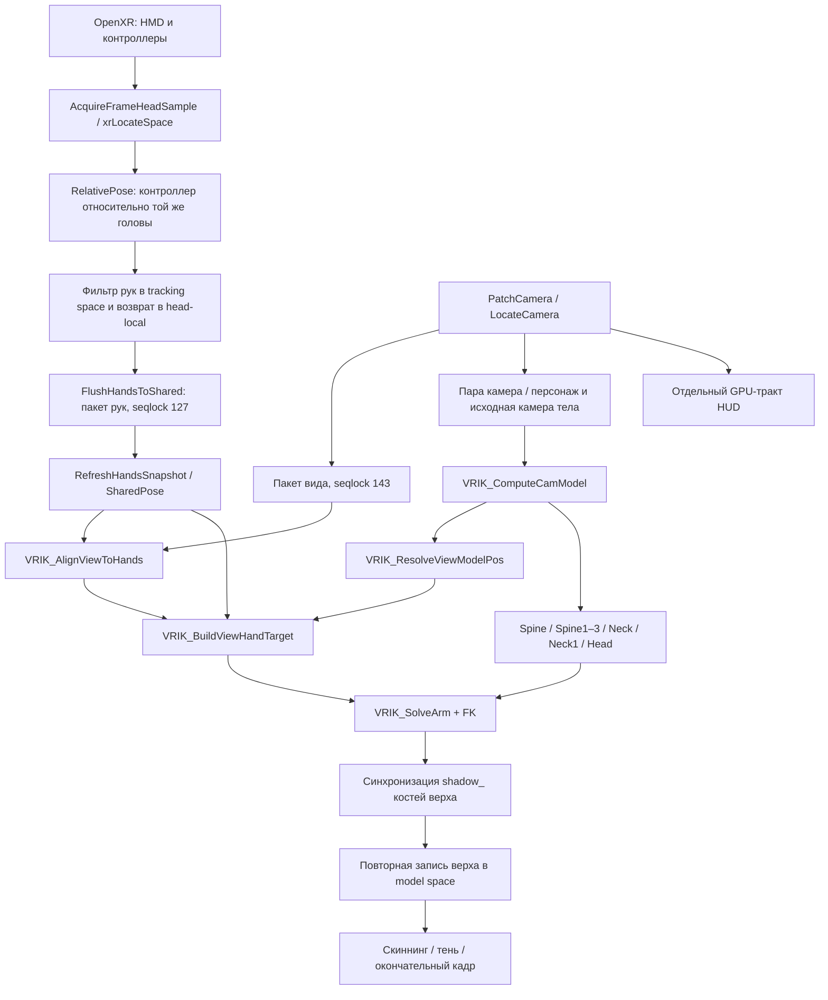

# Цепочка позы VRIK и синтетические проверки — 20.09.2026

Результат: 14 новых проверок VRIK и 21 существующая регрессионная проверка
проходят. В отдельной сборке намеренно возвращены четыре ошибки; тесты
обнаружили каждую. Release DLL собирается. Визуальный результат новой
сборки в шлеме пока не проверен: игра закрыта пользователем.

Исходное наблюдение пользователя: остаточные подёргивания тела, рук и HUD
при совместном повороте и перемещении HMD существовали до roomscale;
основной вид стабилен, WASD такого поведения не даёт. Частота кадров и
cadence не используются как объяснение и не менялись для этой работы.

## Полный маршрут и границы проверки

| Участок | Что проверено / что остаётся вне стенда |
| --- | --- |
| OpenXR и latch головы | Входы задаются синтетически. Реальный вызов runtime, соответствие `XrTime` и выбор кадра драйвером требуют запуска игры. |
| Tracking → head-local | Общая производственная `RelativePose`; совместные повороты и смещения, две разные исходные системы координат. |
| Фильтр и смена origin | Имеющийся набор проверок tracking/filter/reset. В сквозной проверке контроллер неподвижен, поэтому фильтр не должен создавать движение. |
| Shared memory | Настоящий читатель пакета: частичная запись, сохранение предыдущего целого пакета, первая незавершённая публикация. Это детерминированные межоперационные сценарии, не проверка гонок многопоточным анализатором. |
| Пара камера/персонаж | Настоящий `VRIK_ComputeCamModel` с внедрёнными поставщиками данных: native, согласованный Lua fallback, явная инвалидизация. |
| Вид → цель руки | Общие функции используются тестом и обеими ветками рук в `AnimPose`: нейтральная и ненейтральная опорная голова, компенсация ориентации, model-space origin, ненулевые смещения и wrist correction. |
| Скелет | Настоящие FK, верх тела и IK обеих рук на сохранённом скелете из 619 костей. |
| Повторные проходы | Верх удерживает model-space позу после изменения таза/ноги; локальные значения нативного низа и служебных узлов сохраняются. |
| Тень | Проверены 17 совпадающих `shadow_` алиасов верха в этой MetaRig. Отдельный теневой компонент и конечный shadow draw в игре не исполняются. |
| HUD | Не входит в CPU-стенд. `Stereo/Hud.cpp`, `Render/ColorBlit.cpp` и debug hand overlay имеют отдельные потребители поз. Исправление всего HUD не заявляется. |

Исходники: `src/Runtimes/OpenXRManager.cpp`, `src/Anim/HandSnapshot.cpp`,
`src/Anim/CharacterRig.cpp`, `src/Hooks/AnimPose.cpp`,
`src/Natives/VrikArming.cpp`. Стенд: `tools/vrik_tests`.

## Найденные ошибки и изменения

1. Поиск по подстроке `spine` выбирал четыре анатомические кости и затем
   `Torso_Spine_DriverOffset_GRP`, `Torso_Spine1_Q_GRP`,
   `Torso_Spine1_R_GRP`, `Torso_Spine1_P_GRP`. Теперь выбираются только
   точные имена `Spine` и `Spine` с числовым суффиксом.
2. Голове присваивалась ориентация камеры без исходного базиса кости.
   В сохранённой reference-позе model quaternion головы приблизительно
   `(0.707107, 0, 0.707107, 0)`. Теперь ориентация равна
   `cameraModelRotation * referenceHeadModelRotation`. Нейтральная голова
   сохраняет правильные анатомические оси.
3. Нейтральный quaternion опорной головы `(0,0,0,1)` трактовался как
   отсутствие позы, поэтому пропускалось согласование с новой позой HMD.
   Теперь нейтральная поза обрабатывается на общих основаниях; нулевой или
   нечисловой quaternion отвергается.
4. При первой незавершённой публикации `SharedPose` мог читать сырой
   частично записанный пакет. Теперь до первого целого пакета руки невалидны.
5. Начало координат рук на native-пути повторно строилось через Lua
   зеркала мировых координат и другой базис. Теперь model-space начало
   берётся из согласованной пары, которую уже использует тело; view delta
   добавляется один раз. Контрпример с разницей базисов 90° воспроизводит
   **141,421 мм** ошибки старого преобразования. Это искусственно заданный
   контрпример, не измерение джиттера в шлеме.
6. Убран захват таза и решатель ног на пешем пути. Нативные Root, Hips,
   ноги и их теневые аналоги сохраняются. Верх использует reference-позу,
   обе кости шеи и лёгкий изгиб верхнего позвоночника до 6°. Head anchor и
   интерфейс camera-only Bake сохранены. Дополнительное сгибание коленей
   через VRIK не добавлялось.
7. Теневые алиасы верха получают model-space положение/ориентацию основной
   цепочки. Индексы разрешаются по именам текущего rig. Видимость головы,
   scale костей и ресурсы мешей не меняются.
8. Пеший повторный проход сохраняет верх в model space и переводит его
   обратно в local относительно текущих нативных родителей. Старое
   сохранение всего низа больше не требуется. Контрпример с изменённым
   тазом даёт **279,125 мм** смещения кисти при сохранённых локальных
   значениях верха; новая запись удерживает цель. В машине остаётся прежний
   локальный кеш рук и передача рук рулевой анимации.

На этом скелете маска верха содержит 456 потомков анатомического позвоночника
после исключения служебных групп, включая лицо и пальцы. Это маска
сохранения при повторных проходах; независимый IK для всех этих костей
не вводился. Теневых алиасов с совпадающими основными костями — 17.

## Результаты

Сквозной сценарий: 362 пакета, по две руки, совместные движения HMD,
два tracking origin, разные опорные ориентации вида, ненулевые калибровочные
смещения. Максимальная ошибка по координате:

| Измерение | Ошибка |
| --- | ---: |
| Построенная цель против независимой ожидаемой цели | 0,00045 мм |
| FK кисти после настоящего IK против цели | меньше 0,001 мм |
| Теневая кость против основной | 0,00030 мм |

Указанная точность — численная погрешность синтетического расчёта. Она не
означает такую точность трекинга или отсутствие видимого джиттера в игре.
Тесты подтверждают побитную сохранность нативного низа, scale и четвёртого
компонента translation; повторная установка позы не накапливает смещение.

Отчёты сохраняются в `build/vrik-chain-20260920/`, результаты проверки с
возвращёнными ошибками — в `build/vrik-regression-probe/results.json`.
Предыдущая рабочая версия исходников сохранена в
`build/vrik-chain-checkpoint-20260920-185959/`.

## Следующая проверка в игре

Нужно проверить итоговую позу и тень при повороте головы с перемещением HMD,
бег с нативными ногами и удобство взгляда вниз. Для остаточного джиттера
остаётся важной граница между фактической публикацией камеры и пакетом рук:
синтетический поставщик даёт согласованные позиции, но сам по себе не
доказывает, что каждый live animation job получил соответствующую им
позицию камеры. Особенно следует проверить поступательное движение HMD
при неизменной ориентации и сочетание со сменой body yaw.

Game HUD и отдельный shadow component требуют проверки конечного кадра.
Успешные CPU-тесты не закрывают эти два участка.

## Установленная сборка

DLL установлена 20.09.2026 в 19:56 через `scripts/deploy_plugin.ps1`.
SHA256: `d26e5e5a8ec53aafd242bc181223eb7761b7fa4faa6da495cbfacba3c97f9f2f`.
Предыдущая DLL и отчёт установки находятся в
`build/roomscale-plugin-deploy-20260920-195643/`.
Скрипт проверил совпадение установленной DLL со сборкой и сохранность
INI/калибровки относительно состояния непосредственно перед заменой.
Игра агентом не запускалась.
